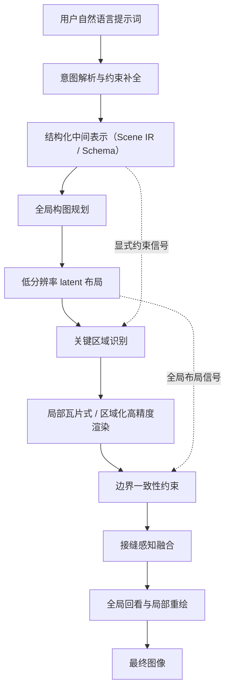

# GPT-IMAGE-2.0 是怎么工作的（狂野的猜想）

[English Version](./README_en.md)

> 免责声明：这不是对任何官方实现的复述，而是一篇基于现象、工程经验和现有生成模型演化路径做出的技术猜想。

我想讨论一个核心判断：像 GPT-IMAGE-2.0 这一代图像模型，**很可能已经不是“用户输入一句提示词，模型端到端直接吐出图像”这么简单**。  
它更像是一个多阶段系统：先把自然语言“编译”成高度结构化的生成规范，再交给一个专门吃这种规范的图像生成器去执行。

如果这个判断成立，那么它相比传统文生图模型的优势就很好解释了：为什么它更擅长复杂构图、更擅长多对象关系、更擅长文字排版，也更擅长把用户那些模糊、口语、跳跃式的需求真正变成可执行的图像任务。


## TL;DR

GPT-IMAGE-2.0 = structured schema + tiled rendering


## 我的两个核心猜想

### 猜想一：提示词不是直接输入给生图模型，而是先被“编译”为特殊的结构化中间提示词

传统生图系统通常把用户 prompt 直接编码，然后让扩散模型或其他生成模型在这个语义条件下出图。  
但在更强的新系统里，我怀疑中间多了一层非常关键的步骤：

1. 先理解用户真正想要什么。
2. 再补全其中省略但实际上重要的隐含信息。
3. 然后把这些信息整理成一份极其复杂的结构化描述（prompt compilation）。
4. 最后由图像模型按这个结构化描述去生成图像。

这个结构化描述未必真的是 JSON，但**从工程角度看，它很像一种中间表示（Intermediate Representation, IR）**。  
JSON 只是我们最容易想象的外在形式。它的本质可能是一份“场景规范”或“图像程序”，里面明确写清楚：

- 画面里有什么对象
- 每个对象的大致位置、尺度和层级
- 风格、镜头、光线、材质、色彩倾向
- 前景、中景、背景的组织关系
- 哪些元素必须精确，哪些元素可以自由发挥
- 是否包含文字，以及文字的内容、字体风格、版式约束
- 哪些局部区域需要重点雕刻，哪些区域只需要保持氛围


#### 一个可能的结构化中间提示词长什么样


```json
{
  "meta": {
    "taskType": "reference-guided object replacement",
    "imageStyle": "<图像风格>"
  },
  "inputAssets": {
    "references": [
      {
        "id": "ref_object_1",
        "type": "image",
        "role": "object_appearance_source",
        "label": "<参考图名称>",
        "extractVisualFacts": [
          "主体类别=<类别>",
          "材质=<材质特征>",
          "主色=<主色信息>",
          "关键识别特征=<必须保留的外观特征>"
        ]
      }
    ]
  },
  "scene": {
    "type": "<空间类型>",
    "mood": "<氛围>",
    "timeOfDay": "<时间段>",
    "humanPresence": "<有人|无人>"
  },
  "camera": {
    "framing": "<画幅>",
    "shotType": "<景别>",
    "angle": "<机位>",
    "lens": "<焦段>",
    "perspective": "<透视要求>",
    "depthOfField": "<景深要求>"
  },
  "lighting": {
    "quality": "<光线类型>",
    "direction": "<入光方向>",
    "contrast": "<反差>",
    "colorTemperature": "<色温>",
    "reflections": "<反射要求>"
  },
  "architecture": {
    "mustPreserve": [
      "<必须保留的空间结构1>",
      "<必须保留的空间结构2>"
    ]
  },
  "objects": [
    {
      "objectType": "reference_object",
      "id": "obj_ref_1",
      "category": "<类别>",
      "reference": "ref_object_1",
      "referenceRole": "identity_anchor",
      "description": "<参考主体外观描述>",
      "placement": {
        "normalizedBox": [0.0, 0.0, 1.0, 1.0],
        "depthLayer": "<foreground|middle|background>",
      },
      "integrationRules": [
      ]
    },
    {
      "objectType": "scene_object",
      "id": "obj_text_surface_1",
      "category": "<带文字的物体类别>",
      "description": "<物体外观描述，表面包含可读文字>",
      "textOnObject": {
        "content": "<物体表面的文字内容>",
        "placement": "<文字位于物体表面的哪个区域>",
        "legibility": "<必须清晰可读|允许轻微透视变形>"
      },
      "placement": {
        "normalizedBox": [0.0, 0.0, 1.0, 1.0],
        "depthLayer": "<foreground|middle|background>"
      }
    },
    ...
  ],
  "renderConstraints": [
    "<约束1>",
    "<约束2>",
    "<约束3>"
  ],
  "renderingPlan": {
    "globalCompositionFirst": true,
    "localRefinementRegions": [
      "<局部精修区域1>",
      "<局部精修区域2>",
      "<局部精修区域3>"
    ]
  }
}
```


#### 解释了现象

- 对超长、超复杂提示词更稳
- 对多对象关系的遵守能力更强
- 对局部要求的响应更细
- 对文字、布局、海报、界面类任务更友好
- 更像“执行需求”而不是“根据气氛自由发挥”

*当然专门经过这种数据训练过的强大模型也极为重要*

## 猜想二：高质量图像不是一次性整张生成，而是分层、分块、分阶段地完成

第二个猜想是：这类系统在渲染层面，很可能也不是“从头到尾一次性生成整张最终图像”，而是采用某种**分层规划 + 瓦片式生成（tile-based generation） + 多阶段细化（progressive refinement）**的策略。

更专业一点地描述，这个过程大致可以表述为：

> 模型可能先建立全局构图，再对图像进行瓦片化或局部分区渲染，并在重叠边界区域施加一致性约束，最后通过接缝感知融合（seam-aware blending）与多轮细化来消除块状拼接痕迹。

这里面有几个关键概念。

### 1. 全局构图先行

如果一开始就直接生成超高分辨率整图，模型很容易顾此失彼：

- 整体构图容易漂
- 局部细节和全局关系互相打架
- 小字、手部、复杂纹理容易崩
- 计算量也会非常夸张

这一步可以理解为“先搭骨架”。

### 2. 再做局部瓦片化细化

在全局布局确定之后，模型再把图像切分成多个局部区域去做高精度渲染。  
这里的“切块”不一定是生硬的九宫格，也可能是：

- 固定大小的网格瓦片
- 带重叠区域的滑动窗口
- 按语义区域自适应划分的 patch
- 在 latent 空间而不是像素空间进行分块


### 3. 边界一致性与接缝消隐

分块生成最大的问题，就是块和块之间容易出现“接缝”。

> 在局部瓦片渲染完成后，系统会通过重叠窗口、边界一致性约束和接缝感知融合，对跨区域过渡进行多轮优化，以消除拼接痕迹并维持整图语义与纹理连续性。

### 4. 这可能不是像素级分块，而是 latent 级分块

还有一个更值得注意的点：真正的系统未必是在最终像素图上切块，而更可能是在**latent 表征空间**里做区域化生成和细化。

原因是 latent 空间里：

- 计算更便宜
- 语义更浓缩
- 更容易控制高层结构
- 更方便多轮迭代和局部修复

这样最终看到的“整图非常统一，但细节又特别密”，就不一定来自一次性直出，而可能来自一种**先全局、后局部；先语义、后细节；先布局、后纹理**的层级式渲染流程。

## 如果把两个猜想合在一起，会得到什么系统图景

把上面两部分拼起来，一个可能的工作流是这样的：

1. 用户输入自然语言提示词。
2. 大模型先解析意图，补全隐含约束。
3. 系统生成结构化中间表示，也就是一份场景级“执行规范”。
4. 生成器先产出全局构图草图或低分辨率 latent 布局。
5. 再对关键区域做瓦片式或区域化高精度渲染。
6. 在边界处施加一致性约束，并做接缝感知融合。
7. 最后通过一到多轮全局回看与局部重绘，得到最终图像。

如果把它画成一张更直观的系统流程图，大概会是这样：



## 为什么我觉得这条路线很合理

因为它几乎同时解决了过去图像模型最难的几类问题：

- 自然语言太模糊，难以稳定执行  
  用结构化中间表示解决。

- 多对象关系复杂，容易彼此干扰  
  用显式布局和区域优先级解决。

- 文字、UI、海报等强约束任务表现差  
  用 schema 化描述和局部重点修复解决。


## 当然，这仍然只是猜想

我并不是说它一定就是这样实现的。  
真实系统可能远比这个更复杂，也可能采用了完全不同的技术细节。

但我觉得有一点大概率是真的：

如果这个方向是对的，那么未来最强的图像生成系统，本质上就不只是“模型”，而更像一个会做理解、规划、检索、编排和渲染协同的图像操作系统。
