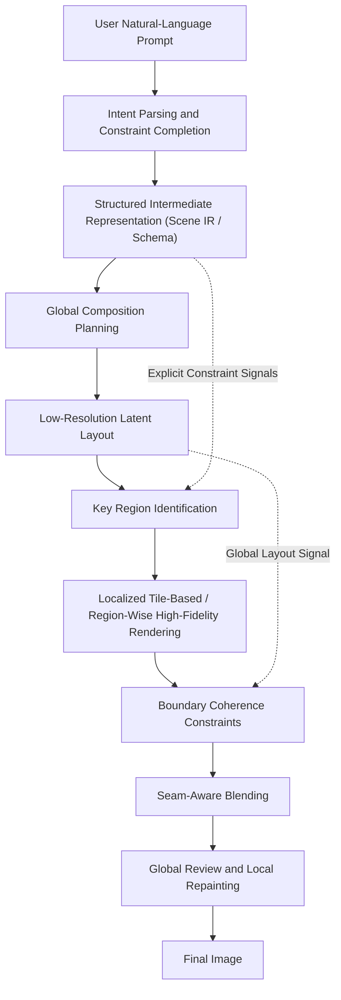

# How GPT-IMAGES-2.0 Might Work: A Speculative Systems Hypothesis

[中文版](./README.md)

> Disclaimer: this is not a restatement of any official implementation. It is a technical hypothesis derived from observed behavior, engineering intuition, and the evolutionary trajectory of contemporary generative models.

I want to put forward a central claim: image models in the GPT-IMAGES-2.0 class are **unlikely to be as simple as "the user provides a prompt, and the model directly emits an image end to end."**  
They are more plausibly multi-stage systems: natural language is first "compiled" into a highly structured generation specification, which is then handled by an image generator specialized for working from that specification.

This article may help explain why it is better at complex composition, richer inter-object relationships, typographic layout, and rendering extremely complex graphics.


## TL;DR

GPT-IMAGES-2.0 = structured schema + tiled rendering


## My Two Core Hypotheses

### Hypothesis 1: the prompt is not passed directly into the image model, but is first "compiled" into a specialized structured intermediate prompt

Conventional image-generation systems typically encode the user's prompt directly and then condition a diffusion model or another generative model on that semantic signal.  
In stronger next-generation systems, however, I suspect there is an additional and extremely consequential intermediate step:

1. First, infer what the user is actually trying to achieve.
2. Then, recover omitted but operationally important implicit information.
3. Next, organize that information into an extremely rich structured description (`prompt compilation`).
4. Finally, let the image model generate against that structured specification.

That structured description may not literally be JSON, but **from an engineering standpoint, it strongly resembles an Intermediate Representation (IR).**  
JSON is merely the easiest external form to imagine. In substance, it may be closer to a "scene specification" or an "image program" that explicitly encodes:

- Which objects are present in the scene
- The approximate position, scale, and hierarchy of each object
- Style, camera, lighting, materials, and chromatic bias
- The organizational relationship among foreground, midground, and background
- Which elements must be rendered with high fidelity and which may remain underdetermined
- Whether text is present, and if so, its content, typographic character, and layout constraints
- Which local regions require concentrated refinement and which merely need to preserve atmosphere


#### What such a structured intermediate prompt might look like


```json
{
  "meta": {
    "taskType": "reference-guided object replacement",
    "imageStyle": "<image style>"
  },
  "inputAssets": {
    "references": [
      {
        "id": "ref_object_1",
        "type": "image",
        "role": "object_appearance_source",
        "label": "<reference image name>",
        "extractVisualFacts": [
          "subject_class=<class>",
          "material=<material properties>",
          "primary_color=<primary color information>",
          "key_identity_features=<appearance traits that must be preserved>"
        ]
      }
    ]
  },
  "scene": {
    "type": "<spatial type>",
    "mood": "<atmosphere>",
    "timeOfDay": "<time of day>",
    "humanPresence": "<occupied|unoccupied>"
  },
  "camera": {
    "framing": "<framing>",
    "shotType": "<shot type>",
    "angle": "<camera angle>",
    "lens": "<focal length>",
    "perspective": "<perspective requirements>",
    "depthOfField": "<depth-of-field requirements>"
  },
  "lighting": {
    "quality": "<lighting type>",
    "direction": "<incident light direction>",
    "contrast": "<contrast>",
    "colorTemperature": "<color temperature>",
    "reflections": "<reflection requirements>"
  },
  "architecture": {
    "mustPreserve": [
      "<spatial structure that must be preserved 1>",
      "<spatial structure that must be preserved 2>"
    ]
  },
  "objects": [
    {
      "objectType": "reference_object",
      "id": "obj_ref_1",
      "category": "<category>",
      "reference": "ref_object_1",
      "referenceRole": "identity_anchor",
      "description": "<appearance description of the referenced subject>",
      "placement": {
        "normalizedBox": [0.0, 0.0, 1.0, 1.0],
        "depthLayer": "<foreground|middle|background>"
      },
      "integrationRules": []
    },
    {
      "objectType": "scene_object",
      "id": "obj_text_surface_1",
      "category": "<object category containing text>",
      "description": "<appearance description of the object, with readable text on its surface>",
      "textOnObject": {
        "content": "<text content on the object's surface>",
        "placement": "<which region of the object contains the text>",
        "legibility": "<must remain clearly legible|minor perspective distortion permitted>"
      },
      "placement": {
        "normalizedBox": [0.0, 0.0, 1.0, 1.0],
        "depthLayer": "<foreground|middle|background>"
      }
    },
    ...
  ],
  "renderConstraints": [
    "<constraint 1>",
    "<constraint 2>",
    "<constraint 3>"
  ],
  "renderingPlan": {
    "globalCompositionFirst": true,
    "localRefinementRegions": [
      "<local refinement region 1>",
      "<local refinement region 2>",
      "<local refinement region 3>"
    ]
  }
}
```


#### What this would explain

- Greater robustness to unusually long and highly complex prompts
- Stronger compliance with multi-object relational constraints
- Finer-grained response to localized requirements
- Better performance on text, layout, poster, and UI-oriented tasks
- Behavior that looks more like "executing a specification" than "improvising from an ambience"

*Of course, a powerful model trained explicitly on such data would still be critically important.*

## Hypothesis 2: high-quality images are not generated in a single monolithic pass, but through layered, tiled, and multi-stage synthesis

My second hypothesis is that, at the rendering level, this class of system is also unlikely to generate the final image in a single end-to-end pass. Instead, it may employ some combination of **hierarchical planning + tile-based generation + progressive refinement**.

In more technical terms, the process might be approximated as follows:

> The model may first establish a global composition, then render the image through tiled or region-wise synthesis, apply coherence constraints over overlapping boundaries, and finally eliminate patching artifacts through seam-aware blending and iterative refinement.

Several ideas matter here.

### 1. Global composition comes first

If the system attempts to generate a very high-resolution image from the outset, it is easy for the model to become internally inconsistent:

- The overall composition drifts
- Local detail and global relational structure conflict with one another
- Small text, hands, and complex textures collapse
- The computational burden becomes excessive

This step can be understood as "laying down the structural scaffold first."

### 2. Then comes localized tiled refinement

Once the global layout has been established, the model can partition the image into multiple local regions for high-precision rendering.  
That partitioning need not be a crude fixed grid. It could instead take forms such as:

<p>
  
  <br />
  <sub>Inset: one observed tile-based generation pattern, included only as an intuition pump.</sub>
</p>

- Fixed-size grid tiles
- Sliding windows with overlap
- Adaptively defined patches based on semantic regions
- Partitioning in latent space rather than pixel space


### 3. Boundary coherence and seam suppression

The largest failure mode of tile-wise generation is visible seams between adjacent regions.

> After local tile rendering is complete, the system may run multiple optimization passes over overlapping windows, boundary-coherence constraints, and seam-aware blending in order to suppress stitching artifacts while preserving semantic and textural continuity across the full image.

### 4. The partitioning may occur in latent space rather than at the pixel level

An even more consequential possibility is that the real system does not tile the final pixel image directly, but instead performs region-wise generation and refinement in the **latent representational space**.

The reasons are straightforward:

- Computation is cheaper
- Semantics are more compressed
- High-level structure is easier to control
- Multi-pass iteration and local repair are easier to perform

If so, the final effect we observe, namely an image that appears globally coherent yet locally dense in detail, may not come from one-shot generation at all, but from a hierarchical rendering pipeline that proceeds **from global to local, from semantics to detail, and from layout to texture**.

## What system picture emerges if we combine the two hypotheses

If we assemble the two ideas above, a plausible workflow might look like this:

1. The user provides a natural-language prompt.
2. A large model parses the intent and completes implicit constraints.
3. The system constructs a structured intermediate representation: a scene-level execution specification.
4. The generator produces a global composition sketch or a low-resolution latent layout.
5. Key regions are then rendered through tiled or region-wise high-fidelity synthesis.
6. Coherence constraints are applied at region boundaries, followed by seam-aware blending.
7. One or more rounds of global review and local repainting produce the final image.

If rendered as a more intuitive systems diagram, it might look something like this:



## Why I find this trajectory highly plausible

Because it addresses, almost simultaneously, several of the hardest historical failure modes of image-generation systems:

- Natural language is too ambiguous to execute reliably  
  Addressed through a structured intermediate representation.

- Multi-object relationships are complex and prone to mutual interference  
  Addressed through explicit layout and regional priority control.

- Strongly constrained tasks such as text, UI, and posters historically underperform  
  Addressed through schema-based specification and targeted local repair.


## Of course, this remains speculative

I am not claiming that the system must be implemented exactly this way.  
The real system may be far more complex, or may rely on entirely different technical details.

But I do think one point is likely true:

If this direction is correct, then the strongest future image-generation systems will not be "models" in the narrow sense. They will look more like image operating systems: systems that coordinate understanding, planning, retrieval, orchestration, and rendering as a unified stack.


This work is licensed under the Creative Commons Attribution 4.0 International (CC BY 4.0) License: https://creativecommons.org/licenses/by/4.0/
